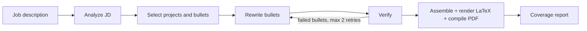

# Resume Tailoring Agent

An AI agent that tailors a LaTeX resume to a job description (JD) and gives you a downloadable one-page PDF. It reorders and rewords your existing content to match the role, and it is built so that **it cannot add experience you don't have**.

> Built for personal use with a free LLM tier (Google Gemini). Paste a JD, get a tailored PDF, `.tex` source, and a keyword-coverage report.

## Features

- **Tailored one-page PDF + `.tex`** from a single source-of-truth file (`data/master.yaml`)
- **JD analysis:** extracts must-have skills, nice-to-have skills, and keywords as structured JSON
- **Smart selection:** picks and orders the most relevant projects and bullets for the role
- **Safe rewriting:** rewords bullets to mirror the JD without changing facts
- **Fact-checking:** every rewrite is checked by code and by a second LLM call; failures fall back to your original text
- **Keyword coverage report:** shows what is on the resume, what is in your master file but not shown, and what you don't have at all
- **Auto-fit to one page:** trims the lowest-ranked content if the resume overflows
- **Streamlit app and CLI**, with download buttons for PDF, `.tex`, and report
- **Mock mode:** run the whole pipeline with no API key to test your setup

## How it works



Built with [LangGraph](https://github.com/langchain-ai/langgraph). The LLM handles understanding and wording; everything that must never be wrong (what is allowed on the resume, skill ordering, page fit) is plain code.

### How it avoids making things up

1. **Only your data is used.** The agent can only pick from, and reword, what is in `master.yaml`. Skills are reordered, never added.
2. **IDs are validated.** The selector can only return project and bullet IDs that exist in your master file.
3. **Code check.** A rewrite is rejected if it adds a number, or a technology term not in the original bullet or its own project's tech list.
4. **LLM fact-check.** A second call compares each rewrite with the original and rejects added claims.
5. **Safe fallback.** A bullet that fails is retried (max 2 times) with the problem described. If it still fails, your original wording is used.
6. **Untrusted input.** The JD is treated as data, not instructions, and is sent only to the analysis step.

## Tech stack

Python, LangGraph, Pydantic, Google Gemini (`google-genai`), Jinja2, LaTeX (`pdflatex` or Tectonic), Streamlit, pytest.

## Project structure

```
resume-agent/
├── data/master.yaml            # all your resume content (edit this)
├── templates/resume.tex.j2     # LaTeX design with placeholders
├── render/latex.py             # fill template, compile PDF, fit to one page
├── agent/
│   ├── schemas.py              # JSON shapes the LLM must return
│   ├── llm.py                  # Gemini wrapper (retry, model fallback)
│   ├── nodes.py                # pipeline steps
│   ├── graph.py                # LangGraph workflow + generate()
│   ├── checks.py               # code-based fabrication checks
│   ├── report.py               # keyword coverage + report
│   └── fake_llm.py             # offline stand-in for testing
├── tools/list_models.py        # list models your API key can use
├── tests/test_pipeline.py
├── run.py                      # command line
├── app.py                      # Streamlit app
└── outputs/                    # generated resumes (git-ignored)
```

## Setup

**Requirements:** Python (developed and tested on 3.12) and a LaTeX installation that includes the `fontawesome5` package (MiKTeX, TeX Live with `texlive-fonts-extra`, or Tectonic).

```bash
python -m venv venv
# Windows: venv\Scripts\activate     macOS/Linux: source venv/bin/activate
pip install -r requirements.txt
```

Get a free API key from [Google AI Studio](https://aistudio.google.com), then:

```bash
cp .env.example .env      # Windows: copy .env.example .env
# open .env and paste your key after GEMINI_API_KEY=
```

Optional: `python tools/list_models.py` shows which models your key can use. Set `GEMINI_MODELS` in `.env` (comma-separated, tried in order) if the defaults are unavailable. Free-tier limits and model availability change, so check Google's current documentation.

## Usage

**1. Check your setup (no API key needed):**

```bash
pytest -q
python run.py --jd jd.txt --company Acme --role "GenAI Engineer" --mock
```

Mock mode uses no AI, so bullets stay unchanged. It only proves the pipeline, LaTeX, and PDF work.

**2. Tailor for real:**

```bash
python run.py --jd jd.txt --company Acme --role "GenAI Engineer"
```

**3. Or use the app:**

```bash
streamlit run app.py
```

Paste the JD, click Generate, then download the PDF, `.tex`, or report.

Each run creates `outputs/<timestamp>_<company>_<role>/` containing the PDF, the `.tex`, and `report.md`.

## Editing your resume (`data/master.yaml`)

`master.yaml` is the single source of truth. Edit it and re-run; no code changes needed.

Text fields support light markup: `**bold**`, `*italic*`, `` `code` ``, `[label](url)`, and `[label](url)^` (adds an external-link icon). Never write raw LaTeX there; special characters (`& % $ # _`) are escaped for you. To change the look, edit `templates/resume.tex.j2` only.

## Privacy

- Your contact details, education, and certificate links are **not** sent to the LLM. Only the JD and your project bullets are.
- On Gemini's free tier, Google may use inputs to improve its models. Check the current terms before sending anything you consider sensitive.
- `data/master.yaml` contains personal details. If your repo is public, use sample data in the committed file (or keep your real file out of git). The privacy test in `tests/test_pipeline.py` checks specific personal strings, so update it to match your sample data.
- Never commit `.env`; it is already in `.gitignore`.

## Limitations

- **Not tested against a live Gemini call in development** (no network access to the API during the build). Your first real run is the first live test; model names and free-tier limits may need adjusting.
- The code check cannot catch vague embellishment such as "production-grade" or "scalable". Always read the PDF before sending it.
- The checker is deliberately strict, so it sometimes rejects a harmless rewrite and keeps your original. That is the safe failure.
- Internships and achievements are carried over unchanged.
- The `tags` fields in `master.yaml` are not used yet.
- Selection currently keeps up to 3 projects (4 bullets each) and, when the page overflows, trims from the end of the ranked list.

## Roadmap

- Backup LLM provider when the Gemini free tier runs out (for example Groq or local Ollama)
- Page-budget-based project selection instead of a fixed count, and relevance-based trimming with `priority` / `must_keep` fields
- Weak-match warning when a JD barely fits your profile
- JD fetching from a URL, cover letter generation, application tracker

## License

This project is licensed under the MIT License.
